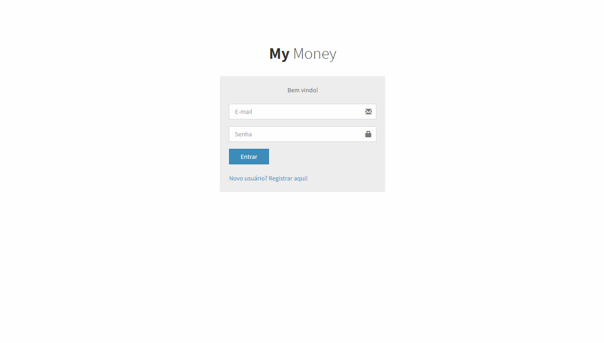

 

  
  

<!-- PROJECT LOGO -->
 

  

  

    Projeto simples de ciclo de pagamentos realizado no curso de <a href='https://www.udemy.com/course/react-redux-pt/'>React/Redux</a> pela <a href="https://www.udemy.com/user/cod3r-3/">COD3R</a>
     
    <a href="https://bv-my-money-app-frontend.herokuapp.com/" target='_blank'>Veja a Demo (Demora carregar)</a>
    ·
    <a href="https://github.com/BrunoViveiros/my-money-app/issues">Reporte um Bug</a>
    ·
    <a href="https://github.com/BrunoViveiros/my-money-app/issues">Solicite uma Feature</a>
  

<!-- ABOUT THE PROJECT -->

## Sobre o Projeto

  

## 🎉 Tecnologias utilizadas

MyMoneyApp utiliza diferentes frameworks e bibliotecas, os principais estão citados abaixo:

- ⚛️[ReactJS](https://pt-br.reactjs.org/) é uma biblioteca JavaScript para criar interfaces de usuário.
- ⚛️[Redux](https://redux.js.org/) é uma biblioteca JavaScript para gerenciar o estado do aplicativo.
- 🅱️[Bootstrap](https://getbootstrap.com/) é um framework web para desenvolvimento de componentes de interface e front-end.
- 📊[AdminLTE](https://adminlte.io/) é um tema de painel de administração e painel de controle.
- ⚙️[Node.js](https://nodejs.org/en/) é um interpretador de JavaScript assíncrono.
- 🍀[MongoDB](https://www.mongodb.com/) é um software de banco de dados orientado a documentos livres.

<!-- GETTING STARTED -->

## 🏠 Getting Started

- [Back-end](backend/README.md)
- [Front-end](frontend/README.md)

<!-- CONTACT -->

## 📫 Contact

Bruno Viveiros - [@BrunoViveiros10](https://twitter.com/BrunoViveiros10) - bruferviveiros@gmail.com

Project Link: [https://github.com/BrunoViveiros/my-money-app](https://github.com/BrunoViveiros/my-money-app)

<!-- LICENSE -->

## 📖 License

Distributed under the MIT License. See [LICENSE](LICENSE) for more information.
